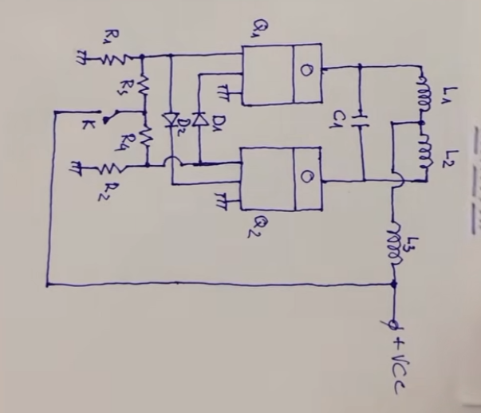

### The Spark-Gap Flyback Driver ZVS circuit
---
The Spark-Gap Flyback Driver Circuit uses 2 mosfets and some passive components to efficiently drive a flyback transformer using DC voltage and high frequency output. It zero-switches the mosfets so theres almost no energy waste. it can also  be used to drive a spark gap tesla coil. when did right, the tesla coil type can give off huge arcs at 240W of impressive output.
Note: Ive made This circuit before with some scrap low- voltage mosfets, it gave me about 4cm of an arc without any capacitors. whenmade with that, it can even reach 1 million VOLTS. and with a joule thief circuit, it can be tripled.
---
Heres the Circuit Schematic:

